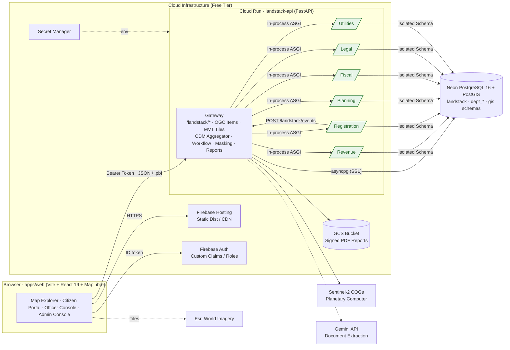

# Hexaverse 2 — Land Stack

### Smart India Hackathon (SIH 2026) · Problem Statement SIH26014
**Ministry of Rural Development / Department of Land Resources (DoLR)**  
*An Integrated GIS-based Digital Public Infrastructure for Land Governance*

[](https://github.com/kbs6108/Hexaverse2/actions/workflows/ci.yml)


---

## 📌 Executive Summary

**Land Stack** gives every land parcel one ULPIN-style (Unique Land Parcel Identification Number) identity and unifies the siloed records maintained by six distinct government departments:
1. **Revenue** (Record of Rights / RoR, ownership, pattas)
2. **Registration** (Deeds, encumbrances, transaction history)
3. **Planning** (Zoning, land use classification, building permissions)
4. **Fiscal** (Property tax assessments, guideline values, dues)
5. **Legal** (Court disputes, lis pendens, caveats)
6. **Utilities** (Water, electricity, road access, municipal connections)

All records are integrated in real time into a unified **Common Data Model (CDM)** with per-source provenance, audit logging, and automated cross-department consistency checks.

---

## 🏛️ System Architecture



---

## 🌟 Key Features & Capabilities

- **🗺️ Three-Tier GIS Map Explorer**:
  - Interactive MapLibre GL viewer with PostGIS dynamic vector tiles (MVT) and optional Esri satellite imagery.
  - 3D unit extrusion support for multi-story cadastres (`ulpin_3d = <ULPIN>-F01-U01`).
- **👥 Citizen Services Portal**:
  - Unified parcel search by ULPIN, survey number, or location.
  - Ownership verification, encumbrance certificate preview, service request submission, and application tracking.
- **👮 Role-Based Officer Console**:
  - Department-specific queues and review workflows (mutation, building permission, grievance redressal).
  - Cross-department conflict and dispute detection alerts.
- **⚙️ Admin & Integration Hub**:
  - State adapter mapping engine to conform diverse state land schemas into the national CDM.
  - Automated consistency validation and audit logging.
- **🛰️ AI & Satellite Change Detection**:
  - Sentinel-2 multi-spectral NDVI/NDBI analysis to flag unrecorded construction and green-cover changes over time.

---

## 🌿 Repository Branch Structure

The project follows a multi-branch workflow:

| Branch | Description |
|---|---|
| **`main`** | Project overview, architecture specification, and release documentation. |
| **`Balaji`** | **Active full-stack codebase** containing the complete monorepo (FastAPI gateway, 6 department microservices, React web app, PostGIS migrations, tools, and Docker environments). |
| **`sampath`** | Upstream feature integration and workflow configurations. |

> 💡 **To view and run the full monorepo code**, switch to the [`Balaji`](https://github.com/kbs6108/Hexaverse2/tree/Balaji) branch:
> ```bash
> git checkout Balaji
> ```

---

## 🚀 Quick Start (Local Development)

To run the complete platform locally:

```bash
# 1. Switch to the development branch containing the code
git checkout Balaji

# 2. Configure environment variables
cp apps/api/.env.example apps/api/.env
cp apps/web/.env.example apps/web/.env

# 3. Spin up services using Docker Compose
make up
```

Once started:
- **Web App**: [http://localhost:5173](http://localhost:5173) *(Includes demo role switcher in header)*
- **API Gateway & Swagger UI**: [http://localhost:8000/docs](http://localhost:8000/docs)

---

## 📂 Monorepo Structure

```
Hexaverse2/
├── apps/
│   ├── api/          # FastAPI gateway + 6 department microservices (Python 3.12)
│   └── web/          # React 19 + TypeScript + MapLibre GL frontend
├── db/
│   └── migrations/   # Idempotent PostGIS SQL migrations
├── docs/             # Technical specifications (CONTRACTS.md, SETUP.md, STD.md)
├── infra/            # Docker compose, Cloud Run deployment, Firebase hosting config
└── tools/            # Migration, seed data generation, Sentinel-2 fetch utilities
```

---

## 📍 Demo Area
- **Test Cadastre**: Peri-urban Mangalagiri, Guntur district, Andhra Pradesh (Synthetic cadastre with real bounding box coordinates).
