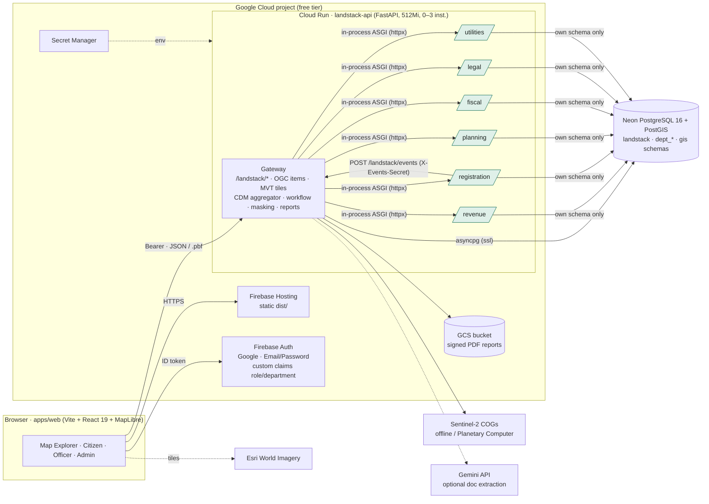

# Land Stack — parcel-centric GIS for land governance

[](https://github.com/OWNER/Hexaverse2/actions/workflows/ci.yml)
  

Land Stack (SIH 2026 prototype) gives every land parcel one ULPIN-style identity and stitches the
records that six departments keep about it — revenue (RoR), registration (deeds, encumbrances),
planning (zones, building permissions), fiscal (tax, guideline value), legal (disputes) and
utilities — into a single **Common Data Model** with per-source provenance and consistency checks.
On top sit a three-tier **Map Explorer** (MapLibre, PostGIS vector tiles, optional Esri imagery,
3D unit extrusion), a **Citizen Portal** (search, verify ownership, track, request), an **Officer
Console** (KPIs, queues, mutation / building-permission workflows) and an **Admin & Integration
Console** (connectors, adapter mappings, consistency findings, simulated upstream events), plus
Sentinel-2 change detection that flags unrecorded construction. Everything runs on free tiers:
Firebase Hosting + Auth, Cloud Run, Neon PostGIS.

## Architecture



## Quick start (Docker)

```bash
cp backend/.env.example backend/.env && cp apps/web/.env.example apps/web/.env
make up          # PostGIS → migrations + deterministic seed → API :8000 → web :5173
open http://localhost:5173   # dev mode: switch between the six demo users in the header
```

`make help` lists every target (`test`, `lint`, `demo-reset`, `deploy-api`, `deploy-web`, `neon-migrate`, …).

## Documentation

| Doc | Contents |
|---|---|
| [docs/SETUP.md](docs/SETUP.md) | Step-by-step: local run, Neon, Firebase, Cloud Run, keys, demo-day checklist, troubleshooting |
| [docs/CONTRACTS.md](docs/CONTRACTS.md) | Source of truth: layout, env vars, roles, schema, CDM, API, workflow, layers |
| [docs/STD.md](docs/STD.md) | Standard Technical Document (architecture, schemas, API/GIS/security standards, UI, deployment) |
| [backend/README.md](backend/README.md) | Gateway + department sub-apps |
| [apps/web/README.md](apps/web/README.md) | Web app |
| [infra/README.md](infra/README.md) | docker-compose, Cloud Run, Firebase Hosting |
| [data/README.md](data/README.md) | What is real vs synthetic in the demo AOI |

## Repository map

```
backend      FastAPI gateway + six department sub-apps (Python 3.12)     apps/web   Vite + React + MapLibre
backend/db    plain SQL, idempotent, applied in order                     backend/tools  migrate · seed · demo_reset · set_claims · fetch_s2
infra/        docker-compose · cloudrun/ · firebase/                      docs/      CONTRACTS · SETUP · STD
```

Demo area: peri-urban Mangalagiri, Guntur district, AP (real bbox, synthetic cadastre — see `data/README.md`).
