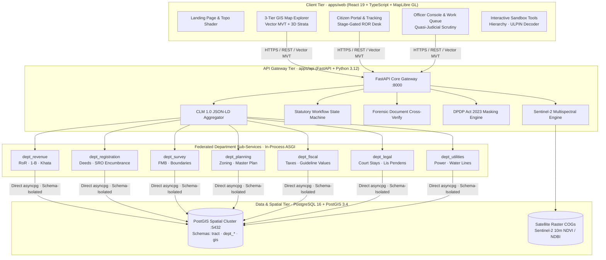

# Tract (Hexaverse) · Integrated Cadastral GIS & Digital Public Infrastructure for Land Governance

[-emerald?style=for-the-badge&logo=github-actions)](https://github.com/kbs6108/Hexaverse2/actions)
[](https://www.python.org/)
[](https://fastapi.tiangolo.com/)
[](https://react.dev/)
[](https://www.typescriptlang.org/)
[-336791?style=for-the-badge&logo=postgresql&logoColor=white)](https://postgis.net/)
[](https://www.iso.org/standard/51206.html)
[](https://www.meity.gov.in/)

> **Smart India Hackathon 2026** · Problem Statement **SIH26014** (Ministry of Rural Development / Department of Land Resources)  
> *"An Integrated GIS-based Digital Public Infrastructure for Land Governance"*

---

## Executive Summary

In India, **over 66% of all civil court cases are land and property disputes**, locking an estimated **$200 Billion in dead capital** and taking an average of **20 years to resolve**. This crisis stems from severe administrative fragmentation: land records are scattered across disconnected institutional silos—Revenue, Registration (SRO), Cadastral Survey, Town Planning, Utilities, and Forest Departments—operating under incompatible vocabularies and isolated databases.

**Tract (Hexaverse)** unifies this landscape into a sovereign Digital Public Infrastructure. By assigning every land parcel a unique 14-character **ULPIN (Unique Land Parcel Identification Number)**, Tract stitches institutional records into an interoperable **Common Data Model (CLM 1.0 JSON-LD)** with cryptographic provenance hashes, automated Sentinel-2 satellite change detection, ISO 19152 3D volumetric cadastre, linear corridor severance analysis, and stage-gated quasi-judicial scrutiny under the **ROR Act §5** and **DPDP Act 2023**.

---

## 🌟 Core Breakthroughs & Features

### 1. 6-Department CLM 1.0 JSON-LD Federation
* **Unified Single Source of Truth**: Live federated data exchange across **Revenue** (1-B/RoR/Pahani), **Registration** (Sale Deeds, 30-year Encumbrance Certificates), **Survey** (FMB village maps), **Town Planning** (Master plans, building permissions), **Fiscal** (Guideline values, tax arrears), **Legal** (Lis Pendens, civil suits), and **Utilities** (Discom power lines, Jal water mains).
* **Multi-State Revenue Dialects**: Native translation adapters across three states:
  * **Andhra Pradesh**: *Meebhoomi* (Adangal, 1-B, Pattadar Passbook).
  * **Tamil Nadu**: *Patta Chitta* (FMB, TSLR, SRO encumbrances).
  * **Telangana**: *Dharani* (Passbook, RoR, prohibited properties).
* **Cryptographic Provenance**: Every record carries an immutable SHA-256 provenance hash and department signature (`dept_revenue`, `dept_registration`, etc.) preventing unauthorized backroom modifications.

### 2. ISO 19152 3D Volumetric Cadastre
* **Multi-Layer Vertical Titling**: Sub-surface basements, ground parcels, and multi-story structural apartments with Above Ground Level (AGL) and Below Ground Level (BGL) elevation envelopes.
* **3D-ULPIN Suffixing**: Full compliance with ISO 19152 Land Administration Domain Model (`<ULPIN>-U01`, `<ULPIN>-U02`, `<ULPIN>-F01-U01`).
* **Utility Easement Envelopes**: Visualizes underground water pipelines, metro tunnel rights-of-way, and overhead HT transmission line buffer easements in 3D.

### 3. Linear Infrastructure Corridors & RFCTLARR 2013 Severance
* **Infrastructure Right-of-Way (ROW)**: Spatial corridor overlays for National Highways (NHAI), Metro Rail networks, and Dedicated Freight Corridors.
* **Corridor Severance Calculation**: Automated geometric intersection computing residual parcel fragmentation, severance percentage, and statutory compensation awards under the **RFCTLARR Act 2013 §23A / §64**.
* **Statutory Claim Triage**: Citizen compensation claims pass through VRO parcel-take verification, statutory hearings, and Tahsildar direct consent settlement awards.

### 4. Sentinel-2 Satellite Change Detection
* **Multispectral Automated Monitoring**: 10-meter resolution satellite pipeline analyzing **NDVI (Normalized Difference Vegetation Index)** drops and **NDBI (Normalized Difference Built-up Index)** surges.
* **Unrecorded Construction & Encroachment Flags**: Automatically raises triage alerts for Mandal Revenue Officers when unpermitted structures appear on agricultural or government land.

### 5. Resurvey & Bounded Boundary Correction
* **State Survey & Boundaries Act Compliance**: On-map boundary editing with strict statutory boundaries.
* **±15% Area Variance Ceiling**: Automated topological validation rejects boundary expansions that exceed statutory tolerance or overlap adjoining ryot lands.
* **Cadastral Snap Assistant**: Snaps proposal vertices to adjacent Field Measurement Book (FMB) boundary traverse points, ratified via dual-officer signoff (Mandal Surveyor $\to$ Tahsildar).

### 6. 4-Stage Statutory Revenue Desk Scrutiny
* **ROR Act §5 Sequential State Machine**: Applications cannot leapfrog authority; they must pass sequentially through designated revenue desks:
  1. **VRO Desk**: Ground spot verification, ryot panchanama, and 15-day statutory notice board publication.
  2. **Mandal Surveyor Desk**: FMB traverse measurement, boundary demarcation, and geometry validation.
  3. **Revenue Inspector (RI) Desk**: 30-year link document audit, encumbrance verification, and title continuity.
  4. **Tahsildar / MRO Desk**: Quasi-judicial hearing, formal approval endorsement, or reasoned speaking order for rejection.

### 7. Forensic Document Cross-Verification Engine
* **Deed Fact Extraction**: Multimodal AI parses uploaded sale deeds, gift instruments, and patta certificates.
* **Ground-Truth PostGIS Cross-Matching**: Automated cross-verification of deed survey numbers, extent ($m^2$), and parties against the official cadastre.
* **Tamper & Risk Fingerprinting**: SHA-256 instrument pinning, active encumbrance checks, and pending court dispute warnings.

### 8. DPDP Act 2023 Consent & Privacy Architecture
* **Purpose-Bound Tokenization**: Public parcel views cryptographically mask citizen identity (`R*** K***`, `K-****`).
* **Consent-Governed Unmasking**: Digital Personal Data Protection Act 2023 compliance with auditable unmasking tokens for registered buyers, financial institutions, and statutory officers.

### 9. Trilingual Institutional Localization
* **Authentic Terminology**: Native English, Telugu (తెలుగు), and Hindi (हिन्दी) support with genuine rural revenue terminology (1-B పహణీ, పట్టాదారు, మ్యుటేషన్, హద్దుల కొలత; खतौनी, खसरा, दाखिल-खारिज, मेढ़ पैमाइश).

---

## 🏛️ System Architecture


```mermaid
flowchart TB
  subgraph Client["Client Tier · apps/web (React 19 + TypeScript + MapLibre GL)"]
    direction TB
    LP["Landing Page & Topo Shader"]
    MAP["3-Tier GIS Map Explorer<br/>Vector MVT + 3D Strata"]
    CIT["Citizen Portal & Tracking<br/>Stage-Gated ROR Desk"]
    OFF["Officer Console & Work Queue<br/>Quasi-Judicial Scrutiny"]
    SIM["Interactive Sandbox Tools<br/>Hierarchy · ULPIN Decoder"]
  end

  subgraph Gateway["API Gateway Tier · apps/api (FastAPI + Python 3.12)"]
    GW["FastAPI Core Gateway :8000"]
    AGG["CLM 1.0 JSON-LD Aggregator"]
    WF["Statutory Workflow State Machine"]
    DOC["Forensic Document Cross-Verify"]
    MASK["DPDP Act 2023 Masking Engine"]
    S2["Sentinel-2 Multispectral Engine"]
  end

  subgraph Depts["Federated Department Sub-Services · In-Process ASGI"]
    REV["dept_revenue<br/>RoR · 1-B · Khata"]
    REG["dept_registration<br/>Deeds · SRO Encumbrance"]
    SUR["dept_survey<br/>FMB · Boundaries"]
    PLN["dept_planning<br/>Zoning · Master Plan"]
    FIS["dept_fiscal<br/>Taxes · Guideline Values"]
    LEG["dept_legal<br/>Court Stays · Lis Pendens"]
    UTL["dept_utilities<br/>Power · Water Lines"]
  end

  subgraph Storage["Data & Spatial Tier · PostgreSQL 16 + PostGIS 3.4"]
    DB[("PostGIS Spatial Cluster :5432<br/>Schemas: tract · dept_* · gis")]
    S2DATA[("Satellite Raster COGs<br/>Sentinel-2 10m NDVI / NDBI")]
  end

  MAP & CIT & OFF -->|"HTTPS / REST / Vector MVT"| GW
  GW --> AGG & WF & DOC & MASK & S2
  AGG --> REV & REG & SUR & PLN & FIS & LEG & UTL
  REV & REG & SUR & PLN & FIS & LEG & UTL -->|"Direct asyncpg · Schema-Isolated"| DB
  S2 --> S2DATA
```

---

## 📍 Representative Demo Scenarios

The platform includes pre-baked, production-grade test parcels across peri-urban Mangalagiri (AP), Sriperumbudur (TN), and Shamshabad (TG):

| Scenario | ULPIN | Location & Region | Key Verification Highlight |
| :--- | :--- | :--- | :--- |
| **3D Strata Unit** | `TFCM91641E6C82` | Sy 126, Mangalagiri (AP) | ISO 19152 volumetric sub-surface basement and multi-story units (`-U01`, `-U02`). |
| **Corridor Severance** | `TFCM91KDED50FD` | Sy 145/2, Amaravati Corridor (AP) | NHAI highway ROW buffer intersection, severance impact, and RFCTLARR compensation award. |
| **Satellite Alert** | `TFCM91D3533DD2` | Sy 131, Mangalagiri (AP) | Sentinel-2 10m automated change detection flagging agricultural land-use conversion. |
| **Civil Court Dispute** | `TFCM9167B91686` | Sy 129, Mangalagiri (AP) | Lis Pendens injunction marker with active civil suit stay under CPC Order 39. |
| **Bank Mortgage** | `TFCM916196F0FE` | Sy 124, Mangalagiri (AP) | Active SBI charge/mortgage encumbrance with lender discharge requirement. |
| **Pending Mutation** | `TFCM914291996F` | Sy 122/1, Mangalagiri (AP) | 4-Stage desk review undergoing sequential VRO $\to$ Surveyor $\to$ RI $\to$ Tahsildar scrutiny. |

---

## 🚀 Quick Start (Local Docker Setup)

### Prerequisites
* **Docker & Docker Compose** (Docker Desktop 4.25+)
* **Node.js 22+** & **npm 10+** (for host frontend builds)
* **Python 3.12+** & **uv** (for host CLI tooling)

### 1. Clone & Configure Environment
```bash
git clone https://github.com/kbs6108/Hexaverse2.git
cd Hexaverse2

# Copy environment templates
cp apps/api/.env.example apps/api/.env
cp apps/web/.env.example apps/web/.env
```

### 2. Launch Full Stack with Docker
```bash
# Spins up PostGIS (:5432) -> Runs SQL Migrations (001-017) -> Starts FastAPI (:8000) -> Starts Vite (:5173)
docker compose -f infra/docker-compose.yml up -d
```

### 3. Verify Container Health
```bash
docker compose -f infra/docker-compose.yml ps
```

| Service | Container | Internal Port | Host URL |
| :--- | :--- | :--- | :--- |
| **Web Frontend** | `tract-web-1` | 5173 | [http://localhost:5173](http://localhost:5173) |
| **API Gateway** | `tract-api-1` | 8000 | [http://localhost:8000](http://localhost:8000) ([Swagger Docs](http://localhost:8000/docs)) |
| **Spatial Database**| `tract-db-1` | 5432 | `localhost:5432` (`tract/tract`) |

---

## 🧪 Test Suite & Quality Assurance

The codebase enforces strict end-to-end verification across Python services and TypeScript frontends:

```bash
# Run full backend test suite (111 passed / 100% green)
apps/api/.venv/bin/pytest

# Run frontend typecheck and production build (0 TypeScript errors)
cd apps/web && npm run typecheck && npm run build
```

### Verified Test Coverage Highlights
* `test_full_e2e_workflows.py`: Multi-user session isolation, 4-stage revenue verification orders, statutory rejection transparency, and DPDP Act 2023 masking.
* `test_aggregator_merge.py`: 6-department CLM 1.0 JSON-LD composition and provenance hashing.
* `test_change_detection.py`: Sentinel-2 multispectral NDVI/NDBI threshold calculations.
* `test_record_correction.py`: Boundary edit validation and area variance compliance.

---

## 📂 Repository Structure

```text
Hexaverse2/
├── apps/
│   ├── api/                           # FastAPI Gateway & Department Services (Python 3.12)
│   │   ├── tract/                 # Core gateway: routers, services, config, db, cdm
│   │   │   ├── routers/               # parcels, applications, ai, documents, alerts, tiles
│   │   │   ├── services/              # aggregator, workflow, boundary, document_verify, masking
│   │   │   └── adapters/              # state revenue adapters (AP, TN, TG)
│   │   ├── departments/               # Isolated sub-apps: revenue, registration, planning, fiscal, legal, utilities
│   │   ├── ai/                        # Satellite change detection & document extraction
│   │   └── tests/                     # 111 comprehensive unit & integration tests
│   └── web/                           # React 19 + TypeScript + MapLibre GL Frontend
│       ├── src/
│       │   ├── components/            # Design system, StatusChip, FloatingDock, Drawer
│       │   ├── features/
│       │   │   ├── map/               # MapLibre viewer, SearchBox, LayerPanel, BoundaryEditor
│       │   │   ├── citizen/           # CitizenHome, ServiceRequest, TrackApplication, VerifyOwnership
│       │   │   ├── officer/           # Work Queue, ApplicationDetail, Alerts
│       │   │   └── marketing/         # 3D Strata Explorer, Statutory Hierarchy, Parcel Decoder
│       │   └── lib/                   # api client, cdm types, authentic i18n (en, te, hi)
├── db/
│   └── migrations/                    # 17 Idempotent SQL migrations (PostGIS extensions through land acquisition)
├── docs/                              # CONTRACTS.md, SETUP.md, STD.md, pitch assets
├── infra/                             # docker-compose.yml, cloudrun/ (deploy scripts), firebase/
└── pytest.ini                         # Root test configuration
```

---

## ⚖️ Statutory & Standards Compliance

* **ISO 19152 (LADM)**: Land Administration Domain Model compliance for 3D volumetric parcels, legal spaces, and strata rights.
* **DPDP Act 2023**: Purpose-bound identity tokenization and cryptographic masking of citizen land holdings.
* **State Survey and Boundaries Act**: Strict area variance bounds ($\le \pm 15\%$) for resurvey adjustments.
* **RFCTLARR Act 2013**: Right to Fair Compensation and Transparency in Land Acquisition, Rehabilitation and Resettlement (§15 objections, §23A/§64 consent awards).
* **OGC API Features & MVT**: Open Geospatial Consortium compliant Mapbox Vector Tile generation directly from PostGIS.

---

## 👥 Authors & Acknowledgements

Developed for the **Smart India Hackathon 2026** by Team **Hexaverse**.  
Built in collaboration with institutional problem statements from the **Ministry of Rural Development (MoRD)** and the **Department of Land Resources (DoLR)**.
